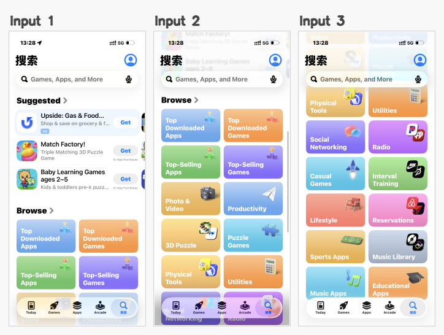
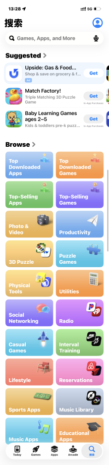
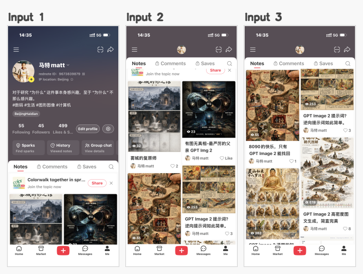
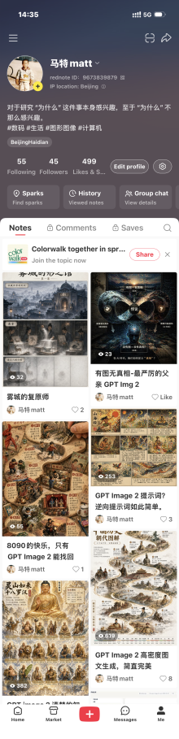
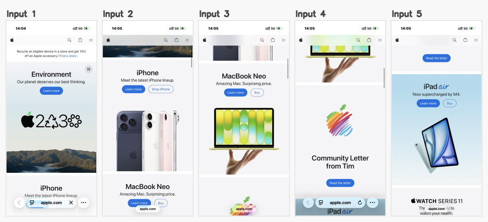
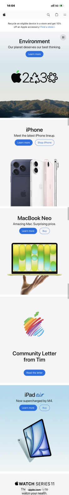
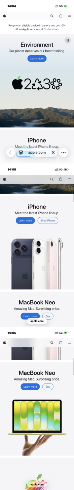

# screenshot-stitcher

[English](README.md) | [简体中文](README.zh-CN.md)

一个小而实用的 CLI，用来把多张纵向连续滚动的 iPhone 截图拼成一张长图。

它更适合同一台设备、同一页面流、按正确顺序输入的截图，尤其适合列表页、应用商店、设置页这类纵向界面。

## 本地优先

你的截图会留在本机。`screenshot-stitcher` 从磁盘读取图片，在当前 Python 进程里运行 OpenCV/NumPy 匹配，然后把拼接结果写回磁盘。它不会把截图、文件名或图片元数据发送到任何外部服务。

这不是 AI 图像生成工具，也不会调用 LLM 或托管的视觉 API。它的拼接流程是确定性的图像处理：裁掉稳定 UI 区域，寻找相邻截图的重叠部分，用视觉特征验证对齐，并选择自然的水平拼接线。

可选的 agent skill 只是一层路由说明。它帮助 Codex、OpenClaw、Claude 等 agent 选择正确的 CLI 命令和参数，真正的图片处理仍然在本地完成。

## Agent / Skill 安装

Agent 需要安装两个部分：

- ClawHub skill：告诉 agent 什么时候、如何调用这个工具
- Python CLI：真正用 OpenCV/NumPy 在本地执行图片拼接

两个都要安装。不要只执行 `clawhub install screenshot-stitcher`；skill 不会自动包含 Python CLI。

```bash
clawhub install screenshot-stitcher
python -m pip install --upgrade screenshot-stitcher
screenshot-stitcher --help
```

如果 agent 在虚拟环境里运行命令，先进入同一个虚拟环境，再执行安装：

```bash
python -m pip install --upgrade screenshot-stitcher
screenshot-stitcher --help
```

完成后，agent 就可以直接使用 `screenshot-stitcher` 命令。如果 `screenshot-stitcher --help` 失败，说明 CLI 被安装到了另一个 Python 环境。

本仓库也包含 skill 源码：[`skills/screenshot-stitcher/`](skills/screenshot-stitcher)。如果 agent 已经在克隆后的仓库里工作，也可以直接读取或安装这个目录。

## CLI 安装

环境要求：

- Python `3.10` 或更新版本
- `pip`
- macOS、Linux 或 Windows，并且当前平台能安装预编译的 `opencv-python` wheel

运行时依赖会自动安装：

- `numpy`
- `opencv-python`

从 PyPI 安装：

```bash
pip install screenshot-stitcher
screenshot-stitcher --help
```

直接从 GitHub 安装：

```bash
pip install "git+https://github.com/mate-matt/screenshot-stitcher.git"
screenshot-stitcher --help
```

从已克隆仓库安装：

```bash
cd /path/to/screenshot-stitcher
pip install .
screenshot-stitcher --help
```

本地开发时可以使用 editable install：

```bash
pip install -e .
python main.py --help
```

安装后可以用内置示例快速验证：

```bash
screenshot-stitcher \
  examples/cases/app-store-search/inputs/01.png \
  examples/cases/app-store-search/inputs/02.png \
  examples/cases/app-store-search/inputs/03.png \
  -o /tmp/app-store-search-stitched.png
```

## 成果展示

整理后的分组案例都放在 [`examples/cases/`](examples/cases) 目录下。

<table>
  <tr>
    <th align="left">案例</th>
    <th align="left">输入截图</th>
    <th align="left">拼接结果</th>
  </tr>
  <tr>
    <td><strong>App Store 搜索页</strong><br/>3 张截图<br/><a href="examples/cases/app-store-search/stitched.png">查看完整结果</a></td>
    <td><a href="examples/cases/app-store-search/preview-inputs.png"></a></td>
    <td><a href="examples/cases/app-store-search/stitched.png"></a></td>
  </tr>
  <tr>
    <td><strong>小红书个人主页</strong><br/>3 张截图<br/><a href="examples/cases/xiaohongshu-profile/stitched.png">查看完整结果</a></td>
    <td><a href="examples/cases/xiaohongshu-profile/preview-inputs.png"></a></td>
    <td><a href="examples/cases/xiaohongshu-profile/stitched.png"></a></td>
  </tr>
  <tr>
    <td><strong>Apple 官网首页</strong><br/>5 张截图<br/><a href="examples/cases/apple-homepage/stitched.png">查看完整结果</a></td>
    <td><a href="examples/cases/apple-homepage/preview-inputs.png"></a></td>
    <td><a href="examples/cases/apple-homepage/stitched.png"></a></td>
  </tr>
</table>

## 为什么不是直接用 GPT-image-2

长截图拼接更像“精确的结构对齐问题”，而不是“开放式图像生成问题”。通用图像模型可以生成看起来合理的结果，但容易重复浏览器栏、重复页面段落，或者把本来应该精确保留的衔接处糊掉。

下面是同一组 Apple 官网首页截图的对比：

<table>
  <tr>
    <th align="left">screenshot-stitcher</th>
    <th align="left">GPT-image-2</th>
  </tr>
  <tr>
    <td><a href="examples/cases/apple-homepage/stitched.png"></a></td>
    <td><a href="examples/comparisons/gpt-image-2/apple-homepage/gpt-image-2.png"></a></td>
  </tr>
</table>

## 功能

- 严格按你传入的顺序拼接截图
- 检测相邻截图的重叠区域，尽量避免重复内容
- 在重叠区选择更自然的水平切线，而不是简单硬切
- 支持通过参数调节顶部/底部 UI 裁剪和左右边缘屏蔽
- 在重叠置信度不足时，提供兜底拼接策略

## 使用方式

```bash
screenshot-stitcher img1.png img2.png img3.png -o output.png
```

也可以直接运行仓库里的入口文件：

```bash
python main.py img1.png img2.png img3.png -o output.png
```

常用参数：

- `--top-crop`：手动指定顶部裁剪像素
- `--bottom-crop`：手动指定底部裁剪像素
- `--no-navbar`：页面没有导航栏时使用
- `--no-tabbar`：页面没有底部 Tab bar 时使用
- `--x-margin`：匹配时左右各裁掉多少像素，默认 `40`
- `--template-height`：重叠检测使用的模板高度
- `--threshold`：接受重叠匹配的置信度阈值

## 工作原理

`screenshot-stitcher` 不会调用 GPT-image-2、LLM 或任何外部视觉 API。整个流程都在本地完成，核心由 OpenCV 驱动：

- 使用 OpenCV 将截图转换成灰度图和边缘特征
- 忽略可配置的顶部/底部 UI 区域和左右噪声边缘
- 通过多尺度模板匹配和行 profile 匹配估计纵向重叠
- 用 ORB 特征和局部 anchor 一致性重新评分候选结果
- 在重叠区域内选择差异较低的水平拼接线
- 最后把原始图片片段堆叠成一张长截图

## 当前适用范围

这个项目故意保持在一个比较窄但实用的范围里：

- 同一台 iPhone 的截图
- 只处理纵向滚动
- 所有输入图片宽度一致
- 图片顺序由用户自己控制

## 已知限制

- 高重复布局仍然可能影响重叠检测
- 临时弹窗、徽标、悬浮元素可能破坏原本可用的重叠区域
- 动态头部、浏览器底栏等场景，有时需要手动调 `--top-crop`、`--bottom-crop` 或 `--x-margin`
- 它不是一个通用全景图引擎，也不是任意图片拼接器

## 开发说明

- `examples/cases/`：README 里成功案例展示使用的素材
- `scripts/build_showcase_assets.py`：用于重新生成展示区的预览图

## License

[MIT](LICENSE)

运行时依赖由 PyPI 安装，并没有 vendored 到本仓库里：

- NumPy：BSD 3-Clause
- opencv-python 包装脚本：MIT
- OpenCV：Apache 2.0

这些都是宽松开源协议，和本项目继续使用 MIT 协议没有明显冲突。如果未来不是普通 PyPI 包，而是打包成包含依赖的二进制应用再分发，需要同时保留对应第三方依赖的许可证和 NOTICE 信息。
